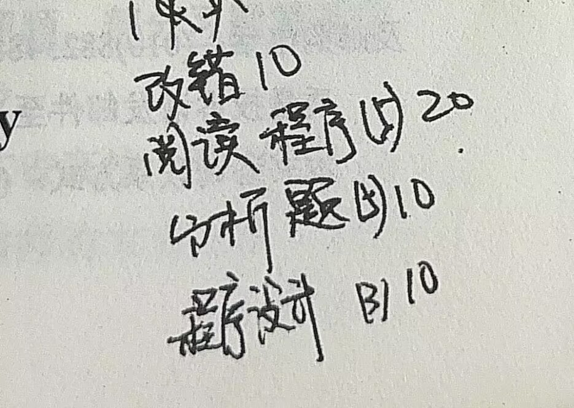

# 第3章 寻址方式与指令系统
期中考试范围 3-4

# 3.1 概述

# 3.2 8086寻址方式
## 3.2.1 立即寻址

## 3.2.2 寄存器寻址

下面均为存储器寻址，双操作数的寻址方式不能都采用存储器寻址方式
## 3.2.3 直接寻址

段超越前缀：改变系统指定的默认段，[汇编学习笔记（三）\_什么是段超越?段超越前缀代表什么?-CSDN博客](https://blog.csdn.net/juliet0727/article/details/88729467)

## 3.2.4 寄存器简接寻址

## 3.2.5 寄存器相对寻址

## 3.2.6 基址变址寻址

## 3.2.7 相对基址变址寻址

# 8086指令系统

## 3.3.1 数据传送指令

1. 通用数据传输指令

2. 累加器指令

3. 地址传送指令

4. 标志传送指令

5. 数据类型转换指令

## 3.3.2 算术运算指令

1. 加法指令

2. 减法指令

3. 乘法指令

4. 除法指令

5. 十进制调整指令

## 3.3.3 位运算指令

1. 位运算指令

2. 移位指令

3. 循环移位指令

## 3.3.4 串操作指令

1. 基本串操作指令

2. 重复前缀指令

## 3.3.5 控制转移指令

1. 无条件转移指令

2. 条件转移指令

3. 循环控制指令

4. 过程调用与返回指令

5. 中断指令

## 3.3.6 处理器指令

