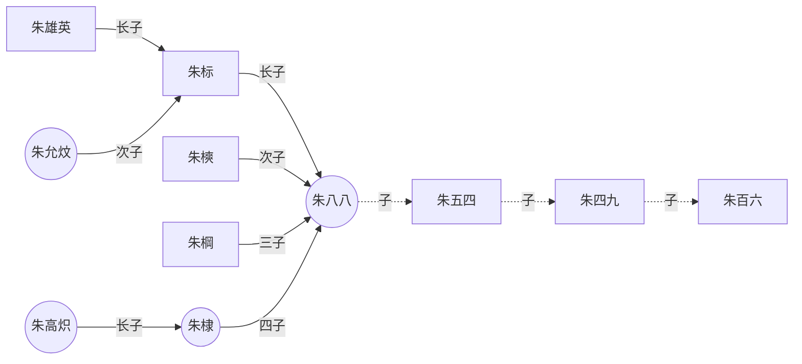

# How to create new blog

[docsify中文官方文档](https://docsify.js.org/#/zh-cn/)

[docsify的配置+全插件列表 - 邓邓的流水账 (xhhdd.cc)](https://xhhdd.cc/index.php/archives/80/comment-page-1)

[【保姆级教程】手把手教你用github制作学术个人主页（学者必备）_github个人主页链接-CSDN博客⁤](https://blog.csdn.net/qd1813100174/article/details/128604858)

[神器docsify 用MarkDown 来写自己的网站_markdown docsify-CSDN博客⁤](https://blog.csdn.net/shiliang97/article/details/110500387)

[介绍 | Valine 一款快速、简洁且高效的无后端评论系统。](https://valine.js.org)

全局安装 docsify-cli 工具
```
npm i docsify-cli -g
```

如果想在项目的 ./docs 目录里写文档，直接通过 init 初始化项目。
```
docsify init ./docs
```

直接编辑 docs/README.md 就能更新文档内容
预览效果
```
docsify serve docs
```

浏览器输入
```
localhost:3000
```

[docsify使用指南 | yukiyama (iyukiyama.github.io)](https://iyukiyama.github.io/docsify-in-action/)

[docsify的学习 - 一只蹒跚学编程的猴子 - 博客园 (cnblogs.com)](https://www.cnblogs.com/monkey-yty/p/15396201.html)

[欢迎回来！ (cnblogs.com)](https://www.cnblogs.com/xhemj/p/How-to-Use-Docsify.html)

[Docsify 进阶配置 - LIUのBlog (clotliu.com)](https://clotliu.com/archives/docsify-advanced)

[Google搜索到自己部署的github网页 - 知乎 (zhihu.com)](https://zhuanlan.zhihu.com/p/601082701)

[Gitalk配置教程 | YuanLiChenAi](https://yuanlichenai.cn/2020/01/16/Gitalk/)

[.gitignore 文件——如何在 Git 中忽略文件和文件夹](https://www.freecodecamp.org/chinese/news/gitignore-file-how-to-ignore-files-and-folders-in-git/)

# how to use markdown
[【Markdown笔记】Markdown中添加和使用希腊字母_希腊字母在md语法中-CSDN博客](https://blog.csdn.net/u012028275/article/details/115057245)

[MarkDown语法 超详细教程 - 经验分享 - Obsidian 中文论坛](https://forum-zh.obsidian.md/t/topic/435)
# docsify in macos

[docsify搭建和简单使用(mac)\_docsify 模板 csdn-CSDN博客](https://blog.csdn.net/qq_22211217/article/details/121446815)

[mac 安装homebrew\_brew 源查看-CSDN博客](https://blog.csdn.net/qq_22211217/article/details/121446948)

[【配置git和github】github鉴权失败 git配置github 免密登录-CSDN博客](https://blog.csdn.net/qq_18479497/article/details/127269105)

[「详细教程」使用git将本地项目上传至Github仓库（MacOS为例）\_github上传代码到仓库-CSDN博客](https://blog.csdn.net/qq_36332660/article/details/131024361)

[GitHub - zolrath/obsidian-auto-link-title: Automatically fetch the titles of pasted links](https://github.com/zolrath/obsidian-auto-link-title)

# test function

## 流程图测试




